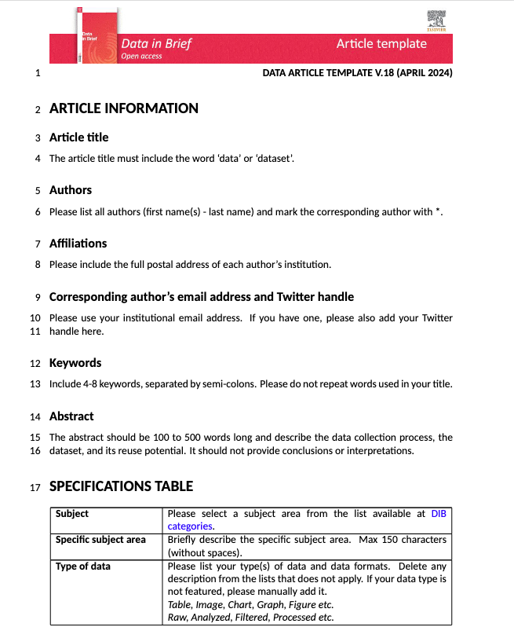

# Data in Brief - Overleaf template

This is the unofficial Data in Brief article template in Overleaf.

> **Important:** You must use `lualatex` to compile this project. Other compilers like `pdflatex` or `xelatex` may not work correctly.

[Open in Overleaf](https://www.overleaf.com/read/zpfnzsqjpdyb#b8967e)

## Screenshot

